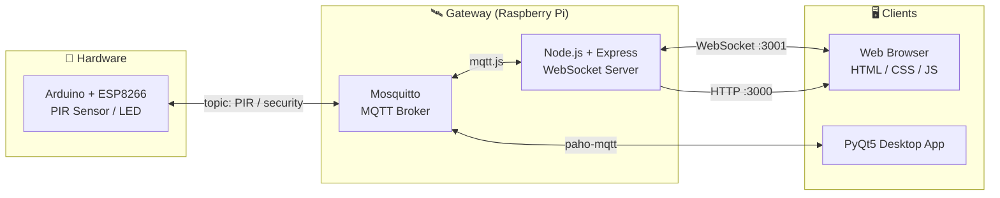

<div align="center">

[English](README.md) | 한국어

# 🚪 Entrance Detection

### Arduino · MQTT · Web · PyQt 기반 IoT 보안/방범 시스템

_현대의 방범 장치를 간소화한 IoT 데모 — 백엔드, 프론트엔드, 임베디드를 잇는 팀 프로젝트_

<br/>

<p>
  
  
  
  
  
  
  
  
  
  
</p>

</div>

---

## 목차

- [프로젝트 소개](#프로젝트-소개)
- [팀 구성](#팀-구성)
- [시스템 아키텍처](#시스템-아키텍처)
- [주요 기능](#주요-기능)
- [기술 스택](#기술-스택)
- [프로젝트 구조](#프로젝트-구조)
- [설치 및 실행](#설치-및-실행)
- [데모 갤러리](#데모-갤러리)
- [Maintainer](#maintainer)

---

## 프로젝트 소개

**Entrance Detection** 은 가정/사무실 출입 감지를 가정한 소형 IoT 보안 데모입니다.
PIR 모션 센서를 단 아두이노가 MQTT 브로커를 통해 이벤트를 발행하면, 같은 브로커에 연결된 **Node.js 웹 서버** 와 **PyQt5 클라이언트**가 동시에 상태를 갱신합니다.

> 한 줄 요약 — **하드웨어(아두이노) ↔ 게이트웨이(Node/Mosquitto) ↔ 사용자(Web/PyQt)** 3계층을 MQTT/WebSocket으로 묶은 풀스택 IoT 실습 프로젝트.

---

## 팀 구성

| 이름 | 역할 | 담당 |
|---|---|---|
| **최선우** | 백엔드 | MQTT 브로커, Node.js / Express 웹 서버 |
| **남궁희** | 프론트엔드 | 웹 UI (HTML / CSS), PyQt5 클라이언트 |
| **김우현** ([@mrpc2003](https://github.com/mrpc2003)) | 임베디드 | 아두이노 회로 구성 및 펌웨어 |

---

## 시스템 아키텍처



데이터 흐름 핵심:
- 아두이노가 `PIR` 토픽으로 감지 결과를 publish
- Node.js 서버가 MQTT 메시지를 수신해 WebSocket으로 웹에 푸시
- PyQt5 / Web에서 발행한 `security` 토픽 메시지가 다시 아두이노로 전달되어 보안 모드를 토글

---

## 주요 기능

각 기능별로 4개 컴포넌트가 어떻게 동작하는지 한눈에 정리한 매트릭스입니다.

| # | 기능 | Web | Node.js | PyQt | Arduino |
|---|---|---|---|---|---|
| 1 | **보안 ON/OFF 토글** | 버튼 → WebSocket 송신 | 메시지 라우팅 | 상태 OFF로 동기화 | 감지 발행 중단/재개 |
| 2 | **침입 감지 알림** | 경보 UI 갱신 | MQTT→WS 브리지 | — | PIR 이벤트 publish |
| 3 | **택배 도착 알림** | 택배 이미지 표시 | PyQt→Web 전달 | "택배" 버튼 publish | — |
| 4 | **도둑 감지 모드** | — | — | 경고음(MP3) 재생 | — |
| 5 | **보안 해제 (비밀번호 정상)** | 보안 해제 UI | PyQt→Web 전달 | OFF 신호 송신 | 감지 발행 중단 |
| 6 | **보안 해제 (비밀번호 오류)** | — | — | 경고음(MP3) 재생 | — |

---

## 기술 스택

**Backend & Messaging**
- Node.js / Express `^4.18`
- WebSocket (`ws` `^8.8`), `socket.io` `^4.5`
- `mqtt.js` `^4.3`, Mosquitto Broker

**Embedded**
- Arduino (ESP8266) + `PubSubClient`, `SoftwareSerial`
- PIR 모션 센서 + LED

**Desktop / Vision**
- Python 3 + PyQt5 + `paho-mqtt` + `pygame`
- (옵션) `face_recognition` + OpenCV + Flask 라이브 스트리밍 모듈

**Frontend**
- HTML5 / CSS3, Vanilla JS WebSocket Client

---

## 프로젝트 구조

```text
iot-entrance-detection/
├── Entrance-Detection-webpage-main/
│   └── project_koss/
│       ├── main.js              # Express + WebSocket + MQTT bridge
│       ├── template.js          # 서버 사이드 HTML 템플릿
│       ├── back_qt.py           # PyQt 보조 스크립트
│       ├── package.json
│       ├── KOSS_AD/             # 정적 페이지 (switch / invasion / noinvasion)
│       └── public/              # first 페이지 정적 자원
├── pyqt_ad/
│   ├── WlsWlsWls.py             # PyQt5 메인 클라이언트
│   └── curse.mp3                # 경고 사운드
├── face_recognition/
│   ├── face_recog.py            # 얼굴 인식 코어
│   ├── camera.py                # OpenCV 캠 래퍼
│   ├── live_streaming.py        # Flask 영상 스트리밍
│   ├── templates/index.html
│   └── knowns/                  # 등록된 얼굴 이미지
├── security/
│   └── security.ino             # 아두이노(ESP8266) 펌웨어
└── 방범 IOT_20220820.xmind      # 기획 마인드맵
```

---

## 설치 및 실행

### 빠른 실행

```bash
# 1) Node 웹 서버
cd Entrance-Detection-webpage-main/project_koss
npm install
node main.js                 # http://localhost:3000  (WebSocket :3001)

# 2) PyQt 클라이언트
cd ../../pyqt_ad
read -s -p "Unlock password: " KOSS_AD_UNLOCK_PASSWORD; echo
export KOSS_AD_UNLOCK_PASSWORD
python WlsWlsWls.py

# 3) 아두이노 펌웨어
#    Arduino IDE 에서 security/security.ino 를 ESP8266 보드로 업로드
```

> ⚠️ `main.js`, `security.ino`, `WlsWlsWls.py` 의 `192.168.x.x` MQTT 브로커 IP는 본인 환경에 맞게 수정해야 합니다. PyQt 해제 비밀번호는 코드에 저장하지 않고 `KOSS_AD_UNLOCK_PASSWORD` 환경변수로 주입합니다.

<details>
<summary><b>🐧 Raspberry Pi · Mosquitto 풀 셋업 (펼치기)</b></summary>

```bash
# 시스템 업데이트 & 한글 입력기
sudo apt update
sudo apt full-upgrade
sudo apt install fonts-unfonts-core
sudo apt remove ibus ibus-hangul
sudo apt install fcitx fcitx-hangul
sudo reboot
sudo raspi-config

# Mosquitto MQTT 브로커
cd ~
wget http://repo.mosquitto.org/debian/mosquitto-repo.gpg.key
sudo apt-key add mosquitto-repo.gpg.key
cd /etc/apt/source.list.d/
sudo wget http://repo.mosquitto.org/debian/mosquitto-stretch.list
sudo apt-get update
sudo apt-get install mosquitto mosquitto-clients
sudo /etc/init.d/mosquitto start
sudo systemctl enable mosquitto
sudo systemctl status mosquitto
```

</details>

<details>
<summary><b>🟢 Node.js · Express 셋업 (펼치기)</b></summary>

```bash
sudo curl -sL https://deb.nodesource.com/setup_16.x | sudo -E bash -
sudo apt-get install -y nodejs
sudo apt-get install gcc g++ make
sudo apt install build-essential

sudo npm install -g pm2
sudo npm install -g express
sudo npm install -g express-generator
```

</details>

<details>
<summary><b>🐍 Python · MQTT · PyQt5 셋업 (펼치기)</b></summary>

```bash
# MQTT 클라이언트
pip install paho-mqtt

# PyQt5
sudo apt-get install python3-pyqt5
sudo apt-get install qt5-default pyqt5-dev pyqt5-dev-tools
sudo -H pip install --upgrade --ignore-installed pip setuptools
sudo pip3 install PyQt5
sudo pip3 install PyQt5-tools
sudo apt-get install qttools5-dev-tools
```

</details>

---

## 데모 갤러리

> 실행 화면 캡처 — 외부 호스팅(GitHub user-content)

### 🌐 Web

| | |
|:---:|:---:|
|  |  |
|  |  |

<div align="center">


</div>

### 🖥 PyQt 클라이언트 / 🔌 회로

| PyQt5 Client | Hardware Wiring |
|:---:|:---:|
|  |  |

---

## Maintainer

이 저장소는 **김우현 ([@mrpc2003](https://github.com/mrpc2003))** 이 호스팅하는 팀 프로젝트 아카이브입니다.
회로/펌웨어 파트를 담당했으며, 백엔드·프론트엔드 기여는 위 [팀 구성](#팀-구성)을 참고해 주세요.

<div align="center">

<sub>🚪 Made with Arduino, MQTT, Node.js & PyQt5</sub>

</div>
