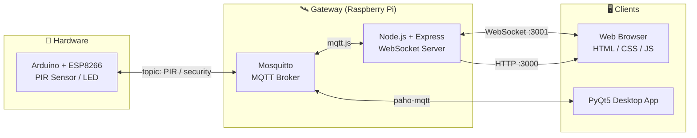

<div align="center">

English | [한국어](README.ko.md)

# 🚪 Entrance Detection

### IoT Security System with Arduino · MQTT · Web · PyQt

_A compact IoT demo that simplifies modern intrusion detection — bridging backend, frontend, and embedded in one team project_

<br/>

<p>
  
  
  
  
  
  
  
  
  
  
</p>

</div>

---

## Table of Contents

- [About](#about)
- [Team](#team)
- [Architecture](#architecture)
- [Features](#features)
- [Tech Stack](#tech-stack)
- [Project Structure](#project-structure)
- [Setup & Usage](#setup--usage)
- [Demo Gallery](#demo-gallery)
- [Maintainer](#maintainer)

---

## About

**Entrance Detection** is a small-scale IoT security demo designed for home/office intrusion monitoring.
An Arduino with a PIR motion sensor publishes detection events through an MQTT broker; a **Node.js web server** and a **PyQt5 desktop client** connected to the same broker update their state in real time.

> TL;DR — A full-stack IoT practice project connecting **Hardware (Arduino) ↔ Gateway (Node.js / Mosquitto) ↔ Clients (Web / PyQt)** across three layers via MQTT and WebSocket.

---

## Team

| Name | Role | Responsibility |
|---|---|---|
| **Choi Seonwoo** | Backend | MQTT broker, Node.js / Express web server |
| **Namgung Hee** | Frontend | Web UI (HTML / CSS), PyQt5 client |
| **Kim Woohyun** ([@mrpc2003](https://github.com/mrpc2003)) | Embedded | Arduino circuit design & firmware |

---

## Architecture



Key data flow:
- Arduino publishes detection results on the `PIR` topic
- Node.js server receives MQTT messages and pushes them to the web via WebSocket
- Messages published on the `security` topic from PyQt5 / Web are relayed back to the Arduino to toggle security mode

---

## Features

A per-component matrix showing how each feature operates across the four layers.

| # | Feature | Web | Node.js | PyQt | Arduino |
|---|---|---|---|---|---|
| 1 | **Security ON/OFF toggle** | Button → WebSocket send | Message routing | Sync state to OFF | Stop/resume detection publish |
| 2 | **Intrusion alert** | Alarm UI update | MQTT→WS bridge | — | PIR event publish |
| 3 | **Package arrival notification** | Display package image | PyQt→Web relay | "Package" button publish | — |
| 4 | **Intruder detection mode** | — | — | Alert sound (MP3) | — |
| 5 | **Disarm (correct password)** | Disarm UI | PyQt→Web relay | Send OFF signal | Stop detection publish |
| 6 | **Disarm (wrong password)** | — | — | Alert sound (MP3) | — |

---

## Tech Stack

**Backend & Messaging**
- Node.js / Express `^4.18`
- WebSocket (`ws` `^8.8`), `socket.io` `^4.5`
- `mqtt.js` `^4.3`, Mosquitto Broker

**Embedded**
- Arduino (ESP8266) + `PubSubClient`, `SoftwareSerial`
- PIR motion sensor + LED

**Desktop / Vision**
- Python 3 + PyQt5 + `paho-mqtt` + `pygame`
- (Optional) `face_recognition` + OpenCV + Flask live-streaming module

**Frontend**
- HTML5 / CSS3, Vanilla JS WebSocket Client

---

## Project Structure

```text
iot-entrance-detection/
├── Entrance-Detection-webpage-main/
│   └── project_koss/
│       ├── main.js              # Express + WebSocket + MQTT bridge
│       ├── template.js          # Server-side HTML templates
│       ├── back_qt.py           # PyQt helper script
│       ├── package.json
│       ├── KOSS_AD/             # Static pages (switch / invasion / noinvasion)
│       └── public/              # First-page static assets
├── pyqt_ad/
│   ├── WlsWlsWls.py             # PyQt5 main client
│   └── curse.mp3                # Alert sound
├── face_recognition/
│   ├── face_recog.py            # Face recognition core
│   ├── camera.py                # OpenCV camera wrapper
│   ├── live_streaming.py        # Flask video streaming
│   ├── templates/index.html
│   └── knowns/                  # Registered face images
├── security/
│   └── security.ino             # Arduino (ESP8266) firmware
└── 방범 IOT_20220820.xmind      # Planning mind-map
```

---

## Setup & Usage

### Quick Start

```bash
# 1) Node web server
cd Entrance-Detection-webpage-main/project_koss
npm install
node main.js                 # http://localhost:3000  (WebSocket :3001)

# 2) PyQt client
cd ../../pyqt_ad
read -s -p "Unlock password: " KOSS_AD_UNLOCK_PASSWORD; echo
export KOSS_AD_UNLOCK_PASSWORD
python WlsWlsWls.py

# 3) Arduino firmware
#    Upload security/security.ino to an ESP8266 board via Arduino IDE
```

> ⚠️ The MQTT broker IP (`192.168.x.x`) in `main.js`, `security.ino`, and `WlsWlsWls.py` must be changed to match your local network. The PyQt unlock password is injected via the `KOSS_AD_UNLOCK_PASSWORD` environment variable — never hard-coded.

<details>
<summary><b>🐧 Raspberry Pi & Mosquitto Full Setup (expand)</b></summary>

```bash
# System update & Korean input (optional)
sudo apt update
sudo apt full-upgrade
sudo apt install fonts-unfonts-core
sudo apt remove ibus ibus-hangul
sudo apt install fcitx fcitx-hangul
sudo reboot
sudo raspi-config

# Mosquitto MQTT Broker
cd ~
wget http://repo.mosquitto.org/debian/mosquitto-repo.gpg.key
sudo apt-key add mosquitto-repo.gpg.key
cd /etc/apt/source.list.d/
sudo wget http://repo.mosquitto.org/debian/mosquitto-stretch.list
sudo apt-get update
sudo apt-get install mosquitto mosquitto-clients
sudo /etc/init.d/mosquitto start
sudo systemctl enable mosquitto
sudo systemctl status mosquitto
```

</details>

<details>
<summary><b>🟢 Node.js & Express Setup (expand)</b></summary>

```bash
sudo curl -sL https://deb.nodesource.com/setup_16.x | sudo -E bash -
sudo apt-get install -y nodejs
sudo apt-get install gcc g++ make
sudo apt install build-essential

sudo npm install -g pm2
sudo npm install -g express
sudo npm install -g express-generator
```

</details>

<details>
<summary><b>🐍 Python, MQTT & PyQt5 Setup (expand)</b></summary>

```bash
# MQTT client
pip install paho-mqtt

# PyQt5
sudo apt-get install python3-pyqt5
sudo apt-get install qt5-default pyqt5-dev pyqt5-dev-tools
sudo -H pip install --upgrade --ignore-installed pip setuptools
sudo pip3 install PyQt5
sudo pip3 install PyQt5-tools
sudo apt-get install qttools5-dev-tools
```

</details>

---

## Demo Gallery

> Screenshots hosted on GitHub user-content.

### 🌐 Web

| | |
|:---:|:---:|
|  |  |
|  |  |

<div align="center">


</div>

### 🖥 PyQt Client / 🔌 Circuit

| PyQt5 Client | Hardware Wiring |
|:---:|:---:|
|  |  |

---

## Maintainer

This repository is a team project archive hosted by **Kim Woohyun ([@mrpc2003](https://github.com/mrpc2003))**.
He was responsible for the circuit/firmware portion; see the [Team](#team) section for backend and frontend contributions.

<div align="center">

<sub>🚪 Made with Arduino, MQTT, Node.js & PyQt5</sub>

</div>
